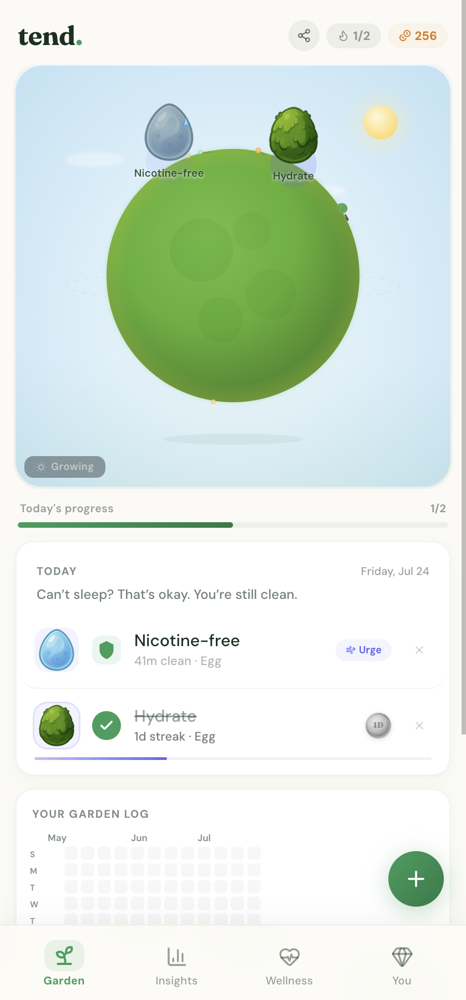
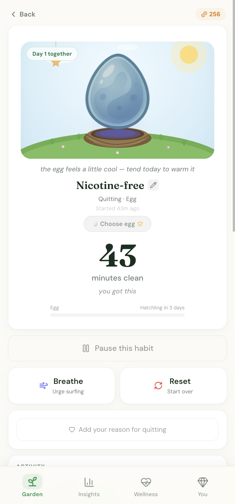
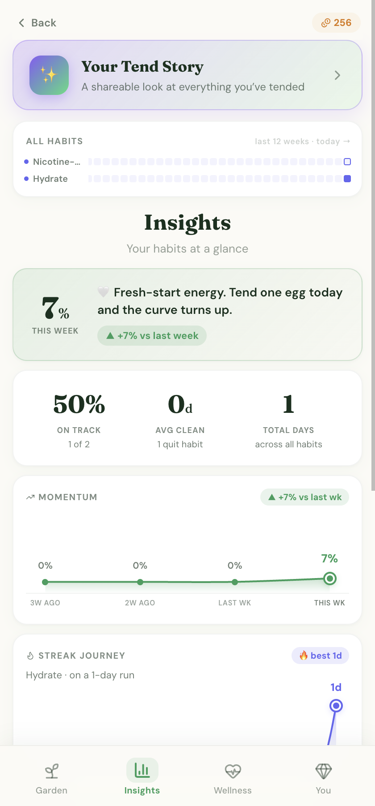
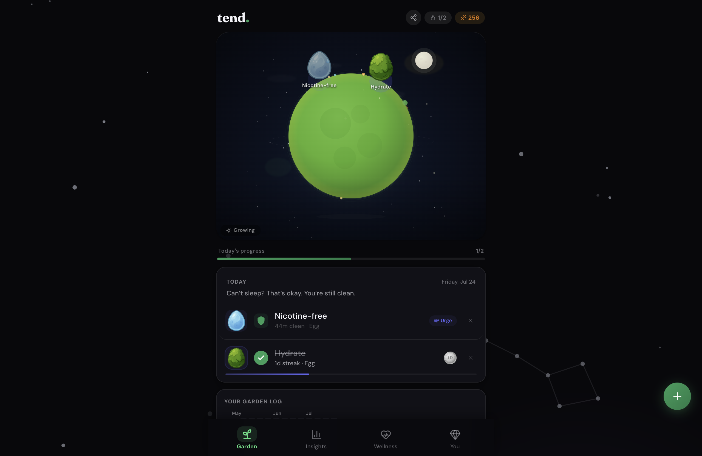

<p align="center">
  
</p>

<h1 align="center">tend.</h1>

<p align="center">
  <strong>Your habits are dragon eggs. Tend them daily and watch them hatch.</strong>
</p>

<p align="center">
  A calm, gamified habit garden — Forest meets Tamagotchi, without the shame.<br />
  Live: <a href="https://www.hatchtend.com">hatchtend.com</a>
</p>

<p align="center">
  
  
  
  
</p>

<br />

<p align="center">
  
</p>

---

## What it is

Most habit apps are a checkbox, a streak counter, and a guilt trip. Tend is a little garden you open every morning. Each habit is a **dragon egg** on a tiny planet — show up, and it warms, cracks, hatches, and grows through five stages. Miss a day? The journey pauses. Your dragon waits. Nothing dies, nothing resets.

> **Assume the best in you.**
> Every day defaults to *"you did well."* Only speak up when you slipped. Honesty is never punished.

<p align="center">
  
</p>

## A look around

<p align="center">
  
  &nbsp;
  
  &nbsp;
  
</p>

<p align="center">
  <em>The daily garden &nbsp;·&nbsp; each dragon's home &nbsp;·&nbsp; insights that motivate, not shame</em>
</p>

<p align="center">
  
</p>

<p align="center">
  <em>Dark mode is a true-black constellation sky.</em>
</p>

## Features

| Area | What you get |
|------|----------------|
| **Dragon-egg garden** | 36 species across fire, water, nature, storm, shadow, light & cosmic |
| **Assumes-best loop** | One-tap "everything went well," quiet slips, grace tokens |
| **Build + quit modes** | Grow habits *and* sobriety-style quit counters as first-class citizens |
| **Urge tools** | Breathe · write it out · redirect — coins for every urge survived |
| **Milestones** | AA-style recovery coins + science-backed healing timelines |
| **Deep insights** | Activity trackers, momentum, synergies, records |
| **Wellness hub** | Breathing, urge surfing, grounding, gratitude — free forever |
| **Tend Wrapped** | A shareable, Spotify-Wrapped-style story of your journey |

**Free** covers the whole emotional core: 5 habit eggs, 12 starter dragons, the full daily loop, all wellness tools, Wrapped. **Tend+** ($4.99/mo · $29.99/yr · or Forever) adds unlimited eggs, all 36 species, deep insights, and full décor.

## Stack

| Layer | Choice |
|-------|--------|
| App | Next.js 16 · React 19 · TypeScript · Tailwind |
| Auth / Data / Payments | Clerk · Supabase (Postgres) · Stripe |
| Hosting | Vercel |
| Art | [2D Dragon Pack](https://babkagd.itch.io/2d-dragon-pack-cute-creature-sprites-fantasy-game-assets-hatch-and-merge-icons) · [Sprout Lands](https://cupnooble.itch.io/sprout-lands-asset-pack) |
| Type | Fraunces + DM Sans |

User data lives in Supabase, keyed to Clerk. localStorage hydrates instantly; the server is source of truth. No tracking pixels, no data brokers.

## Getting started

```bash
git clone https://github.com/JonathanDunkleberger/Tend.git
cd Tend
npm install
cp .env.example .env.local   # fill Clerk / Supabase / Stripe
npm run dev
```

Open [http://localhost:3000](http://localhost:3000) — best at phone width (~375px). Database schema and migrations live under [`supabase/`](./supabase).

## Philosophy

**The core loop is free, forever.** If someone's craving hits at 2 AM, the last thing they should see is a paywall.

**No shame mechanics.** No dying dragons, no red punishment screens. Relapse copy sounds like a friend: *"You went 3 days. That strength is still inside you."*

**Engagement without addiction.** No loot boxes, no guilt notifications, no "your pet is dying" dark patterns. Care, not surveillance.

## Credits

- **Dragon & egg sprites** — [2D Dragon Pack](https://babkagd.itch.io/2d-dragon-pack-cute-creature-sprites-fantasy-game-assets-hatch-and-merge-icons) by Babkagd
- **World / décor roots** — [Sprout Lands](https://cupnooble.itch.io/sprout-lands-asset-pack) by Cup Nooble
- **Icons** — [Lucide](https://lucide.dev/) · **Type** — [Fraunces](https://fonts.google.com/specimen/Fraunces) · [DM Sans](https://fonts.google.com/specimen/DM+Sans)

---

<p align="center">
  <strong>tend.</strong> — Your habits are dragon eggs.<br />
  <a href="https://www.hatchtend.com">www.hatchtend.com</a>
</p>
