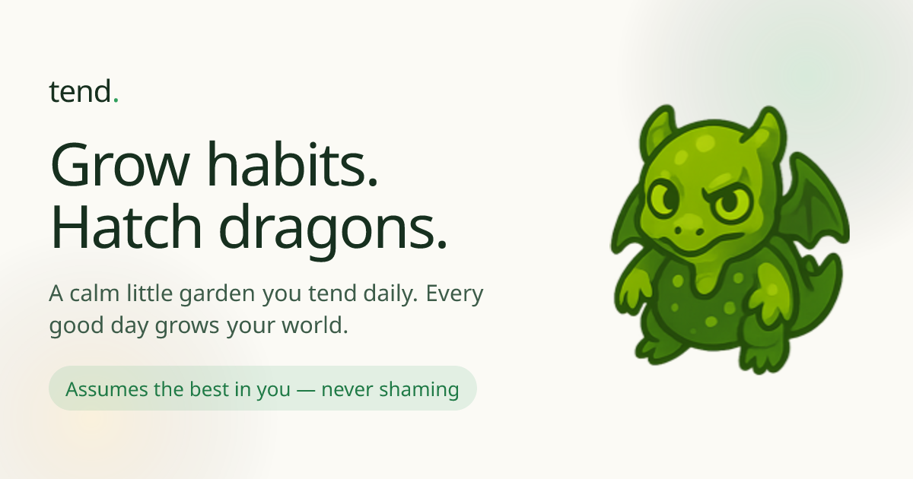
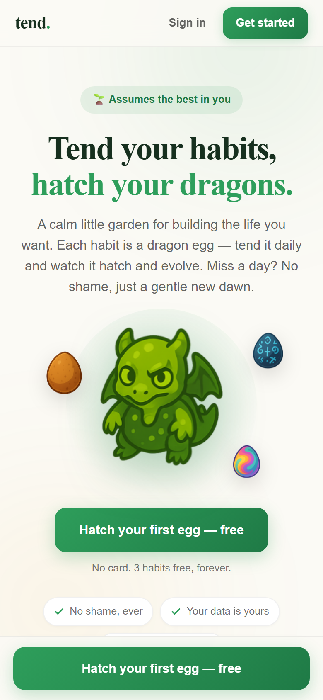
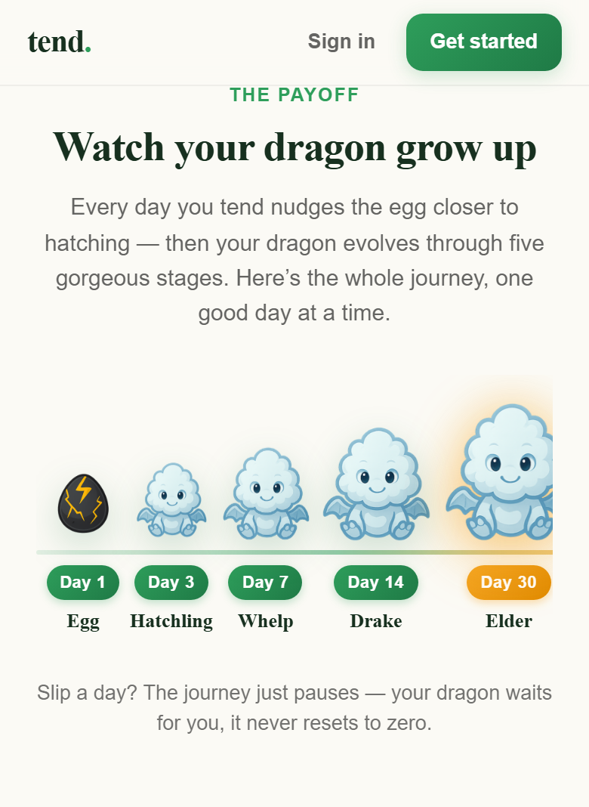
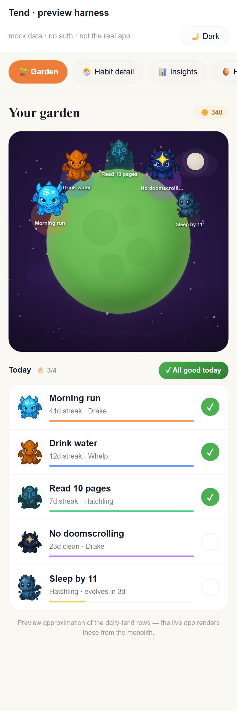
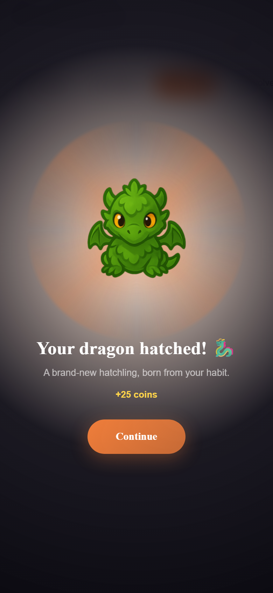
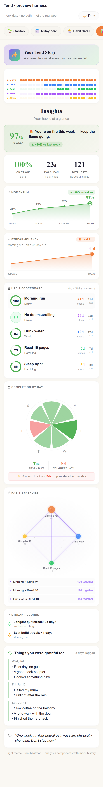
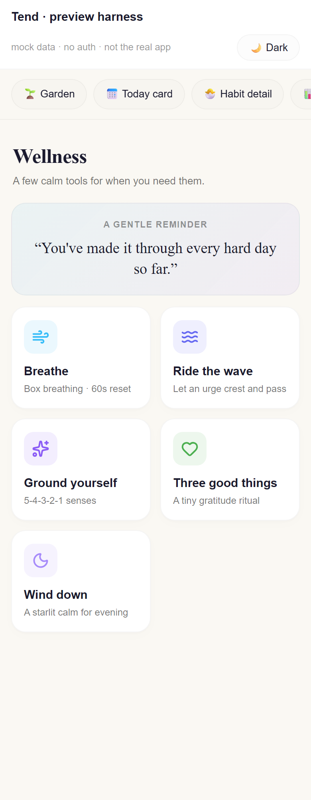
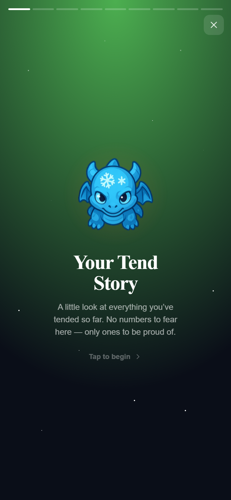

<p align="center">
  
</p>

<h1 align="center">tend.</h1>

<p align="center">
  <strong>Your habits are dragon eggs. Tend them daily and watch them hatch.</strong>
</p>

<p align="center">
  A calm, gamified habit garden — Forest meets Tamagotchi, without the shame.<br />
  Live: <a href="https://www.hatchtend.com">hatchtend.com</a>
</p>

<p align="center">
  <a href="#vision">Vision</a> ·
  <a href="#product">Product</a> ·
  <a href="#features">Features</a> ·
  <a href="#stack">Stack</a> ·
  <a href="#getting-started">Getting Started</a> ·
  <a href="#philosophy">Philosophy</a>
</p>

<p align="center">
  
  
  
  
</p>

<br />

<p align="center">
  
</p>

---

## Vision

Most habit apps are cold: a checkbox, a streak counter, a guilt trip when you miss a day.

**Tend** is the opposite — a little garden you open every morning. Each habit is a **dragon egg**. Show up, and it warms, cracks, hatches, and grows. Miss a day? No shame. The journey pauses. Your dragon waits.

The north star:

> **Assume the best in you.**  
> Default every day to *“you did well.”* Only speak up when you slipped. Never punish honesty.

It should feel like [Forest](https://www.forestapp.cc/) crossed with [Tamagotchi](https://en.wikipedia.org/wiki/Tamagotchi) — warm enough that someone fighting a hard habit still wants to open it at 2 AM.

<p align="center">
  
</p>

---

## Product

### The payoff — watch your dragon grow

Every good day nudges an egg toward hatching, then through five stages:

**Egg → Hatchling → Whelp → Drake → Elder**

<p align="center">
  
</p>

Slip a day? The journey pauses — your dragon never resets to zero.

### The daily garden

Habits live on a tiny planet-garden. One tap — **“All good today”** — marks the day done. Coins, streaks, and grace tokens keep momentum kind instead of cruel.

<p align="center">
  
</p>

### Hatch moments that feel earned

When an egg finally cracks, the ceremony is the reward — a new hatchling, coins, and a reason to come back tomorrow.

<p align="center">
  
</p>

### Insights that motivate, not shame

Heatmaps, momentum curves, streak journeys, day-of-week patterns, habit synergies — beautiful analytics that celebrate progress.

<p align="center">
  
</p>

### Wellness when it matters

Breathing, urge surfing, grounding, gratitude, wind-down — tools that stay free forever, especially for quit habits.

<p align="center">
  
</p>

### Tend Wrapped

A Spotify-Wrapped-style story of your journey — shareable, proud, never clinical.

<p align="center">
  
</p>

---

## Features

| Area | What you get |
|------|----------------|
| **Dragon-egg garden** | 36 species across fire, water, nature, storm, shadow, light & cosmic — each with a matched egg |
| **Assumes-best loop** | One-tap “everything went well,” quiet slips, grace tokens |
| **Build + quit modes** | Grow habits *and* sobriety-style quit counters as first-class citizens |
| **Urge tools** | Breathe · write it out · redirect — coins for every urge survived |
| **Living world** | Planet garden, shop décor, seasonal atmosphere |
| **Milestones** | AA-style recovery coins + science-backed healing timelines |
| **Deep insights** | Heatmap, momentum, synergies, records, gratitude |
| **Tend Wrapped** | Tap-through story of your year (or journey so far) |

### Free vs Tend+

- **Free:** up to 5 habit eggs, 12 starter dragons, full daily loop, all wellness tools, Wrapped, basic insights.
- **Tend+** ($4.99/mo · $29.99/yr · or Forever): unlimited eggs, all 36 species, deep insights, full décor & themes, extra grace + daily coins.

The emotional core — garden, hatching, wellness, relapse compassion — is **never** paywalled.

---

## Stack

| Layer | Choice |
|-------|--------|
| App | Next.js 16 · React 19 · TypeScript · Tailwind |
| Auth | Clerk |
| Data | Supabase (Postgres) |
| Payments | Stripe |
| Hosting | Vercel |
| Art | [2D Dragon Pack](https://babkagd.itch.io/2d-dragon-pack-cute-creature-sprites-fantasy-game-assets-hatch-and-merge-icons) · [Sprout Lands](https://cupnooble.itch.io/sprout-lands-asset-pack) |
| Type | Fraunces + DM Sans |

<p align="center">
  
</p>

User data lives in Supabase, keyed to Clerk. localStorage hydrates instantly; the server is source of truth. No tracking pixels. No data brokers.

---

## Getting Started

```bash
git clone https://github.com/JonathanDunkleberger/Tend.git
cd Tend
npm install
cp .env.example .env.local   # fill Clerk / Supabase / Stripe
npm run dev
```

Open [http://localhost:3000](http://localhost:3000) — best at phone width (~375px).

```bash
npm run build && npm start   # production locally
```

Database schema and SQL migrations live under [`supabase/`](./supabase) — not in the repo root.

---

## Roadmap

**Shipped** — dual-mode habits, urge suite, living garden, hatch cycle, milestone coins, healing timelines, shop, Tend+, Clerk + Supabase sync, Stripe, Wrapped, wellness hub.

**Next**
- [ ] React Native / TestFlight
- [ ] Opt-in push (max 2/day)
- [ ] Sound design
- [ ] Weekly recap + night wind-down polish
- [ ] Anonymous shared planets
- [ ] Seasonal cosmetics & expanded catalog

---

## Philosophy

**The core loop is free. Forever.**  
If someone’s craving hits at 2 AM, the last thing they should see is a paywall.

**No shame mechanics.**  
No dying dragons. No red punishment screens. Honesty earns coins. Relapse copy sounds like a friend: *“You went 3 days. That strength is still inside you.”*

**Your data is yours.**  
Encrypted cloud tied to your account. Sync across devices. Nothing sold.

**Engagement without addiction.**  
No loot boxes. No guilt notifications. No “your pet is dying” dark patterns. Care, not surveillance.

---

## Credits

- **Dragon & egg sprites** — [2D Dragon Pack](https://babkagd.itch.io/2d-dragon-pack-cute-creature-sprites-fantasy-game-assets-hatch-and-merge-icons) by Babkagd
- **World / décor roots** — [Sprout Lands](https://cupnooble.itch.io/sprout-lands-asset-pack) by Cup Nooble
- **Icons** — [Lucide](https://lucide.dev/)
- **Type** — [Fraunces](https://fonts.google.com/specimen/Fraunces) · [DM Sans](https://fonts.google.com/specimen/DM+Sans)

---

<p align="center">
  
</p>

<p align="center">
  <strong>tend.</strong> — Your habits are dragon eggs.<br />
  <a href="https://www.hatchtend.com">www.hatchtend.com</a>
</p>
